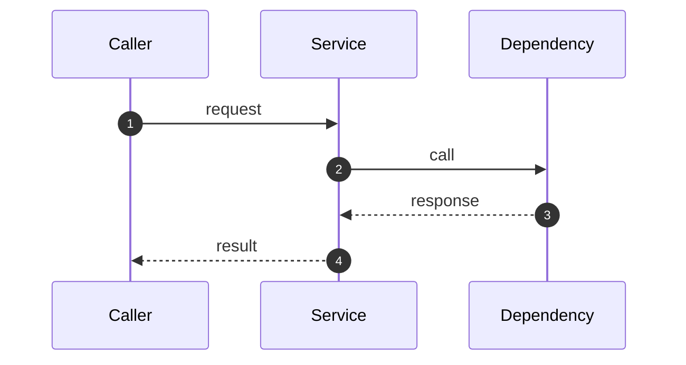

# <功能标题>

文档语言：中文

## 基本信息

- 日期：`YYYY-MM-DD`
- 状态：`设计中 / 实现中 / 已落地 / 已废弃`
- 负责人：`<name>`
- 相关 PR / Commit：`<optional>`

## 背景与问题

说明这个功能为什么要做，当前实现或业务流程存在什么问题。

## 目标

- 目标 1
- 目标 2

## 非目标

- 非目标 1
- 非目标 2

## 核心设计决策

- 决策 1：为什么这样做
- 决策 2：为什么不选其他方案

## 用户可见行为

说明改动前后，用户或调用方能感知到的差异。

## 端到端时序图 / 流程图

## 涉及模块

- `path/to/file_a`
- `path/to/file_b`
- `path/to/file_c`

## 实现细节

### 1. 入口层

说明请求从哪里进入，以及入口的职责。

### 2. 编排层

说明如何路由、调度、管理状态和并发。

### 3. 依赖或下游集成层

说明如何调用外部系统、插件或协议。

## 协议 / 数据结构 / 配置变更

- 新增：
- 修改：
- 兼容性：

## 风险与限制

- 风险 1
- 风险 2

## 验证方式

- 单测：
- 集成测试：
- 手工验证：

## 回滚思路

说明如果这个功能需要回滚，最小回滚面是什么。

## 后续待办

- TODO 1
- TODO 2
